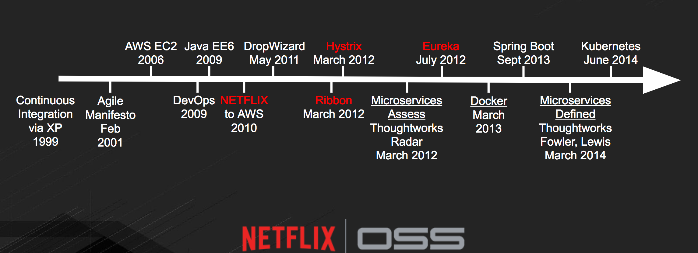

= Overview

**Green Cloud Demo** is your first step on how to migrate and optimize an existing Spring Boot application  to
https://www.openshift.com[OpenShift].  The migration guides you with the process of how to migrate Spring Boot workload form other platform
to https://www.openshift.com[OpenShift], i.e. the build process, the ideal platform (https://www.openshift.com[OpenShift]), optimizing etc.,

== Short History of Microservices

.History of Microservices

Most of the https://netflix.github.io/[Netflix OSS] components listed above are pretty old and optimized more for AWS, they are prone to some common DevOps
pain-points for organizations that are starting to adopt DevOps. The migration that will be done as part of this demo will help in alleviating those possible
DevOps pain-points and provide the organizations a direction on **How to migrate my Spring Boot Application to OpenShift**

== App Overview

In this demo, the https://github.com/kameshsampath/brewery[Spring Cloud Samples - Brewery] will be migrated
and optimized for OpenShift, during the process of migration the original https://github.com/spring-cloud-samples/brewery[Spring Cloud Samples - Brewery]
will be modified to make it deployable on to https://kubernetes.io[Kubernetes] or https://www.openshift.com[Openshift].

The application was migrated iteratively,

* [*] https://redhat-developer-docs.github.io/green-cloud-demo/#iteration-1[Iteration-I] - As-is deployment of the https://github.com/spring-cloud-samples/brewery[Spring Cloud Samples - Brewery]
with no code change.  The Application build process will be modified to enable easier deployment of application on Openshift

* [*] https://redhat-developer-docs.github.io/green-cloud-demo/#iteration-2[Iteration-II] - Will use native OpenShift/Kubernetes features such as service discovery, loadbalancing & externalization of the config

* [*] <<iteration-3>> - Optimizing stacks on OpenShift, like Apache Artemis instead of RabbitMQ, using OpenTracing and Jaeger, and using Kubernetes for client side loadbalancing i.e. No Ribbon for LoadBalancing

[[default-pre-req]]
== Pre-Requisite

You have a OpenShift cluster running locally using https://docs.openshift.org/latest/minishift/getting-started/index.html[*minishift*]
or https://developers.redhat.com/products/cdk/overview/Op[*CDK*], or
have access to https://www.openshift.com/container-platform/index.html[*OpenShift Container Platform*]

[[iteration-3]]

This iteration is more of optimizing the <<iteration-2>> on OpenShift. This iteration has fair bit of code change that is required to port the application to
use:

* https://activemq.apache.org/artemis/[Apache Artemis] in place of RabbitMQ
* http://opentracing.io/[OpenTracing] based tracing and using https://uber.github.io/jaeger/[Jaeger]in place of Zipkin,
* Leveraging Kubernetes load balancing for client services i.e. *No Ribbon for client side load balancing*.

This iteration will also obselete many modules/projects from source tree, refer to the <<itr3-deprecated-modules,deprecate>> section for more details

[[itr3-application-setup]]
== Setup

[[itr3-clone-source]]
=== Clone

[source,sh]
----
git clone -b iteration-3 https://github.com/redhat-developer-demos/brewery.git
----

[NOTE]
====
Through out this document we will call the directoy where the project was cloned as _$PROJECT_HOME_
====

[[itr3-pre-req]]
== Pre-Requisite

[[itr3-pre-req-general]]
=== General
The spring-cloud-kubernetes library used in the project requires the `default` service account to have view permissions, to enable that we execute the following command,

[source,sh]
----
oc policy add-role-to-user view -z default -n $(oc project -q)
----

[[itr3-deployable-apps]]
== Deploy Applications

.Application List
[cols="1*^,1,1,5"]
|===
| |Application| Folder | Remarks

|icon:check[color: green]
|<<itr3-artemis>>
|*$PROJECT_HOME*/extras/apache-artemis
|Message Broker - https://activemq.apache.org/artemis/

|icon:check[color: green]
|common
|*$PROJECT_HOME*/common
|Common shared library, the shared libraries dependencies are updated to leverage RHOAR 1.5.7 BOM

|[red]#*X*#
|[red]#common-zipkin-stream#
|[red]#*$PROJECT_HOME*/common-zipkin-stream#
|Since this iteration has moved all the tracing Components to  http://opentracing.io/[OpenTracing], this module is deprecated/obselete as no Sleuth
Stream will be used, instead the project will use https://github.com/search?q=org%3Aopentracing-contrib+java[Open Tracing Java modules]

|[red]#*X*#
|[red]#eureka#
|[red]#*$PROJECT_HOME*/eureka#
|Application will use https://kubernetes.io/docs/concepts/services-networking/service/[Kubernetes Services]

|[red]#*X*#
|[red]#config-server#
|[red]#*$PROJECT_HOME*/config-server#
|Application will use https://kubernetes.io/docs/tasks/configure-pod-container/configmap/[Kubernetes ConfigMaps]

|[red]#*X*#
|[red]#zipkin-server#
|[red]#*$PROJECT_HOME*/zipkin-server#
| http://zipkin.io/[Distributed Tracing system]

|icon:check[color: green]
|<<itr3-jaeger>>
| Jaeger already provides OpenShift manifests to deploy the same in OpenShift
| https://uber.github.io/jaeger/[Jaeger], a high performing OpenTracing based implementation of Distributed Tracing

|icon:check[color: green]
|<<itr3-zuul>>
|*$PROJECT_HOME*/zuul
| https://github.com/Netflix/zuul/wiki[Java based Proxy]

|icon:check[color: green]
|<<itr3-ingredients>>
|*$PROJECT_HOME*/ingredients
|

|icon:check[color: green]
|<<itr3-reporting>>
|*$PROJECT_HOME*/reporting
|

|icon:check[color: green]
|<<itr3-brewing>>
|*$PROJECT_HOME*/brewing
|

|icon:check[color: green]
|<<itr3-presenting>>
|*$PROJECT_HOME*/presenting
|

|===

[[itr3-build-app]]
=== Building

The Iteration II of the brewery application has migrated all the projects to http://maven.apache.org/[Apache Maven] based build,
to build the application run the following command

[source,sh]
----
./mvnw -N install <1>
./mvnw clean install <2>
----
<1> This will install the brewery parent pom in local maven repository
<2> This will build the applications, if the minishift or OpenShift cluster is running, this will trigger `s2i` builds
of the respective application as well

[[itr3-deploy-to-openshift]]
=== Deploying to OpenShift

As part of this lift and shift of existing application, to make it work as-is, there is certain order of applicaiton deployment might be required.  The following section
explains the deployment of the application in the same order as expected  ( you can expriment with it if you like :) )

[IMPORTANT]
====
Ensure that all <<itr3-pre-req,Pre-Requisite>> are done before starting deployment.
====

[[itr3-artemis]]
==== Apache Artemis

Starting this iteration, the application will be using https://activemq.apache.org/artemis/[Apache Artemis] as message broker in place of RabbitMQ, the following sections details on deploying
Apache Artemis on OpenShift

[[itr3-apache-artemis-local]]
===== Local Deployment

Go to the directory  *$PROJECT_HOME/extras/apache-artemis*, and execute the following command

[source,sh]
----
./mvnw -Dfabric8.mode=kubernetes clean fabric8:deploy
----

[[itr3-apache-artemis-cloud]]
===== External Cloud Deployment

Sometimes you might have access to docker socket typical case when deploying to external cloud, in those cases you can run the following set of commands,

[source,sh]
----
./mvnw clean fabric8:resource
oc apply -f target/classes/META-INF/fabric8/openshift.yml
----

This will take some time to get it running as the deployment needs to download the `apache-artemis` docker image

[[itr3-jaeger]]
==== Jaeger Server

The Jaeger distribution provides the OpenShift deployment manifests to deploy Jaeger, as part of this demo
the https://github.com/jaegertracing/jaeger-openshift[all-in-one] deployment will be used

[source,sh]
----
cd $PROJECT_HOME/extras/jaeger
oc process -f jaeger-all-in-one-template.yml  | oc create -f -
----

[NOTE]
====
Please use the template from sources for all-in-deployment as currently version above 0.8.0 is not able to get the
traces as expected
====

[[itr3-zuul]]
==== Zuul

Go to the directory  *$PROJECT_HOME/zuul*, and execute the following command

[source,sh]
----
./mvnw fabric8:deploy
----

[[itr3-ingredients]]
==== Ingredients

Go to the directory  *$PROJECT_HOME/ingredients*, and execute the following command

[source,sh]
----
./mvnw fabric8:deploy
----

[[itr3-reporting]]
==== Reporting

Go to the directory  *$PROJECT_HOME/reporting*, and execute the following command

[source,sh]
----
./mvnw fabric8:deploy
----

[[itr3-brewing]]
==== Brewing

Go to the directory  *$PROJECT_HOME/brewing*, and execute the following command

[source,sh]
----
./mvnw fabric8:deploy
----

[[itr3-presenting]]
==== Presenting

Go to the directory  *$PROJECT_HOME/presenting*, and execute the following command

[source,sh]
----
./mvnw fabric8:deploy
----

[[itr3-acceptance-testing]]
== Acceptance Testing

[WARNING]
====
As this iteration has lot of module updates and replacements, the old acceptance tests does not hold good. The automated Arquillain based automated tests develoment
is in progress, this section will be updated with needed details once  its in place.
====

[[itr3-deprecated-modules]]

== Deprecated Modules

As part of Iteration-III the following modules have been deprecated,

* Eureka
* Config Server
* common-zipkin
* common-zipkin-old
* common-zipkin-stream
* zipkin-server
* zookeeper
* docker

Please refer to setup guide https://bit.ly/greenclouddemo[here]